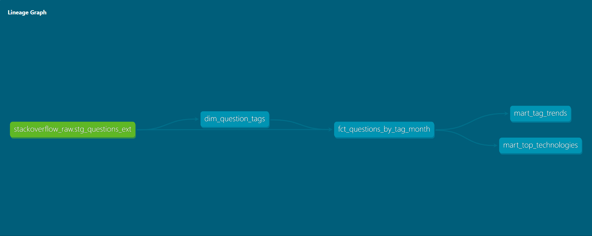

# Stack Overflow Technology Trends Dashboard (2015–2024)

## Problem Description

Stack Overflow is one of the largest developer communities where programmers ask and answer technical questions. The platform contains millions of posts covering programming languages, frameworks, and development tools.

Understanding **technology popularity trends** can help developers, companies, and educators identify which technologies are growing or declining over time.

This project builds a **cloud-based data pipeline and analytics dashboard** to analyze programming technology trends using Stack Overflow data between **2015 and 2024**.

The project answers questions such as:

- Which programming technologies generate the most Stack Overflow questions?
- How have technology trends changed over time?
- Which technologies are growing in popularity?

**This project implements a batch processing pipeline where data is extracted, stored, and transformed in discrete steps rather than processed in real time.**

---

## Dataset

Source dataset:

`bigquery-public-data.stackoverflow.posts_questions`

Main fields used:

| Field | Description |
|------|-------------|
| id | Question ID |
| creation_date | Date the question was created |
| tags | Programming technologies associated with the question |
| score | Community score |
| view_count | Number of views |
| answer_count | Number of answers |

The dataset contains **tens of millions of Stack Overflow questions**.

---

## Architecture
The following diagram shows the end-to-end data flow from raw data ingestion to analytics and visualization.

```text
Terraform
   ↓
GCP Infrastructure
   - BigQuery dataset
   - GCS bucket
   - Required APIs

Stack Overflow Public Dataset (BigQuery)
        ↓
raw_questions
        ↓
Export to GCS Data Lake (Parquet)
        ↓
External BigQuery Table
(stg_questions_ext)
        ↓
dbt Transformation Layer
   Source:
     - stackoverflow_raw.stg_questions_ext
   Models:
     - dim_question_tags
     - fct_questions_by_tag_month
     - mart_top_technologies
     - mart_tag_trends
   Tests:
     - not_null checks
        ↓
Looker Studio Dashboard
```


---

## Technologies Used

- Google Cloud Platform
- BigQuery
- Google Cloud Storage
- Terraform
- dbt
- SQL
- Looker Studio

---

## Infrastructure as Code

Terraform was used to define and manage the cloud infrastructure for this project.

Managed resources include:

- Google Cloud Storage bucket for the data lake
- BigQuery dataset for analytics tables
- Required Google Cloud APIs:
  - BigQuery API
  - Cloud Storage API
  - IAM API
  - Compute Engine API

Terraform configuration files are located in the `terraform/` directory.

---

## Data Pipeline

### 1. Data Extraction

Questions were extracted from the Stack Overflow public dataset:

`bigquery-public-data.stackoverflow.posts_questions`

Data was filtered to include questions between **2015 and 2024**.

---

### 2. Data Lake Storage

The filtered raw dataset was exported to **Google Cloud Storage** in **Parquet format**.

Example path:

`gs://stackoverflow-data-lake-famous-gearing/raw/questions/`


This step simulates a **data lake ingestion layer**.

---

### 3. External Table

An external BigQuery table was created referencing the Parquet files stored in GCS.

Table name:

`stg_questions_ext`

This allows BigQuery to query data stored in the data lake without loading it into native tables.

---

### 4. Transformations

The ingestion process consists of multiple batch steps, including data extraction, export to the data lake, and creation of an external table in BigQuery. 

Transformations were implemented using dbt on top of BigQuery. The dbt project defines source, intermediate, and mart models, along with basic data quality tests. dbt was used to manage dependencies between models, ensuring reproducible and modular transformations.

### dbt Lineage Graph

The dbt project defines model dependencies from the external source through intermediate and mart models.




#### Tag Normalization

Stack Overflow stores multiple tags in a single string field.  
These tags were split into individual records.

Table:

`dim_question_tags`

Structure:

```
question_id | tag
```


---

#### Monthly Aggregation

Questions were aggregated by **tag and month**.

Table:

`fct_questions_by_tag_month`

Metrics include:

- number of questions
- average score
- average views

This table is:

- **Partitioned by month**
- **Clustered by tag**

to improve query performance.

---

### 5. Data Marts

Two analytical tables were created.

#### Top Technologies

`mart_top_technologies`

Contains:

- tag
- total questions
- average score

#### Technology Trends

`mart_tag_trends`

Contains:

- month
- tag
- question_count

These tables are optimized for visualization and analysis.

---

## Dashboard

The project includes a **Looker Studio dashboard** that visualizes technology trends from Stack Overflow.

### Top Programming Technologies by Question Volume

Shows the most discussed programming technologies based on total question count.

Key insight:

JavaScript and Python dominate developer discussions, reflecting their widespread use in web development, backend development, and data science.

---

### Technology Trends Over Time

Shows how selected technologies change in popularity over time.

Technologies analyzed:

- Python
- JavaScript
- Java
- SQL
- Pandas

Key observations:

- Python shows strong growth due to data science and machine learning adoption.
- JavaScript remains consistently dominant because of its role in web development.
- Java remains widely used but grows more slowly compared to Python.
- SQL remains stable due to its foundational role in data systems.

---

## Dashboard Link

Interactive dashboard available here:

https://lookerstudio.google.com/reporting/f0ab5bff-d31a-4a2f-8789-9ad19f4c6254


---

## Reproducibility

To reproduce this project:

### 1. Create a Google Cloud project

Create a new project in Google Cloud and note your `PROJECT_ID`.

### 2. Authentication & Project Setup

Authenticate with Google Cloud and set your project:

```bash
gcloud auth application-default login
gcloud config set project YOUR_PROJECT_ID
```

Note:
Each user must use their own Google Cloud account and project.
This project does not use shared credentials.

Make sure:
- Billing is enabled on your GCP project
- You have sufficient permissions (BigQuery Admin, Storage Admin or equivalent)

This will configure Application Default Credentials (ADC), which are required for:

- BigQuery access
- Google Cloud Storage operations
- dbt BigQuery connection

### 3. Enable required APIs
- BigQuery API
- Cloud Storage API
- IAM API

### 4. Provision infrastructure with Terraform

```bash
cd terraform
terraform init
terraform apply
```

This will create:

- GCS bucket (data lake)
- BigQuery dataset
- Required cloud resources

### 5. Execute the SQL scripts in the sql/ directory using the BigQuery console or bq CLI:

- Execute 01_raw_questions.sql to extract filtered data  
- Execute 02_export_raw_questions_to_gcs.sql to export data to GCS  
- Execute 03_stg_questions_ext.sql to create the external table  

### 6. Run dbt transformations

Ensure dbt is installed and configured with a BigQuery profile.
Then run:

```bash
cd stackoverflow_dbt
dbt run
dbt test
```

### 7. Build Dashboard

Use Looker Studio to visualize the results:

1. Open Looker Studio: https://lookerstudio.google.com/
2. Create a new report
3. Add a data source → select BigQuery
4. Choose your project and dataset
5. Select the following tables:
   - `mart_top_technologies`
   - `mart_tag_trends`

Suggested visualizations:
- Bar chart: Top technologies by total questions
- Time series chart: Technology trends over time (by tag and month)

You can replicate the dashboard used in this project:
https://lookerstudio.google.com/reporting/f0ab5bff-d31a-4a2f-8789-9ad19f4c6254  


## Project Structure

```
stack-overflow-tech-trends/
│
├── README.md
│
├── sql/
│   ├── 01_raw_questions.sql
│   ├── 02_export_raw_questions_to_gcs.sql
│   ├── 03_stg_questions_ext.sql
│
├── terraform/
│   ├── main.tf
│   ├── variables.tf
│   ├── outputs.tf
│   ├── terraform.tfvars
│   └── versions.tf
│
└── stackoverflow_dbt/
    ├── dbt_project.yml
    ├── models/
    │   ├── staging/
    │   │   └── source.yml
    │   ├── intermediate/
    │   │   └── dim_question_tags.sql
    │   ├── marts/
    │   │   ├── fct_questions_by_tag_month.sql
    │   │   ├── mart_top_technologies.sql
    │   │   └── mart_tag_trends.sql
    │   └── schema.yml

```

## Key Insights

Analysis of Stack Overflow questions from 2015–2024 reveals several trends:

- JavaScript remains the most discussed programming language.
- Python shows strong growth, reflecting increased use in data science, AI, and machine learning.
- Java remains widely used, but its growth is slower compared to Python.
- SQL remains stable, reflecting its critical role in databases and analytics.


## Project Outcome

This project demonstrates how to build a cloud-based data engineering pipeline, including:

- data extraction from public datasets
- data lake storage
- warehouse transformations
- analytical data marts
- business intelligence dashboards
- infrastructure management using Terraform
